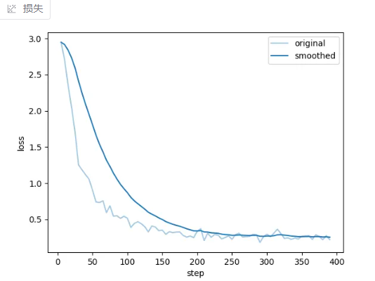

# 模型微调

我们主要是采用 [LLaMA-Factory](https://github.com/hiyouga/LLaMA-Factory) 进行模型微调，具体步骤如下：

## 1. LLaMA-Factory 安装

```bash
git clone --depth 1 https://github.com/hiyouga/LLaMA-Factory.git
cd LLaMA-Factory
pip install -e ".[torch,metrics]" --no-build-isolation
# 使用cuda，可以安装torch-cuda版本(以cuda 12.6为例)
pip3 install torch torchvision --index-url https://download.pytorch.org/whl/cu126
```

具体安装的过程可以参照 [LLaMA-Factory](https://github.com/hiyouga/LLaMA-Factory/blob/main/README.md) 官方的安装说明。

## 2. 数据准备

> 我们参考了 [mllm_demo](https://github.com/hiyouga/LLaMA-Factory/blob/main/data/mllm_demo.json) 的格式，构建了 800 条多模态问答对。

```json
[
  {
    "messages": [
      {
        "content": "<image>当前区域的受灾面积如何？",
        "role": "user"
      },
      {
        "content": "空间分布与灾害影响范围\n影像中红色屋顶建筑（3 处）分散分布，紧邻深色沟壑与绿色植被区。沟壑地形易引发泥石流、滑坡，直接威胁红色建筑；绿色植被区虽未直接受灾，但需警惕灾害扩散（如泥石流冲毁植被波及周边 ），整体灾害影响范围与沟壑走向、建筑分布关联紧密。\n受灾房屋的数量与密度\n红色受灾房屋共 3 处，彼此间距远、密度低，推测单处房屋涉及居住单元少，直接受灾规模有限，但需关注灾害对分散住户的逐个影响。\n通行条件与避难路径\n右侧白色蜿蜒道路连通建筑区与外部，需核查是否因沟壑灾害中断。道路可用则作为救援运输、人员疏散主通道；若中断，周边绿色植被区（草地、林地 ）可临时开辟路径，且植被区开阔地带可作为避难空间，需确保与沟壑保持安全距离。\n人口分布与应急响应优先级\n红色建筑为人口直接受灾点，绿色建筑及植被区可能有常住人口。按建筑规模估算，涉及人口约 10 - 20 人，红色建筑内人员面临直接威胁，需优先救援；绿色建筑人员需提前疏散，若有弱势群体（老人、儿童 ），标记为重点救助对象。\n图像中的遮挡问题\n影像右上角少量云层未遮挡核心建筑、道路，不影响关键信息判断。若需精准分析建筑受损细节（如屋顶破损 ），可补充无人机低空航拍，辅助确认灾害对房屋的破坏程度。",
        "role": "assistant"
      },
      {
        "content": "这些受灾的建筑的整体的受灾情况如何<image>",
        "role": "user"
      },
      {
        "content": "一、完全损坏建筑分布区（极重灾区 ）\n方位：图中深红色（假设对应红色标记 ）建筑位于左侧深色区域旁\n受灾特征：建筑结构彻底坍塌，无完整形态\n潜在风险：废墟易坍塌，威胁救援人员\n救援建议：专业队携探测仪，依规搜救\n二、中度损坏建筑分布区（重灾区 ）\n方位：图中红色（假设对应红色标记 ）建筑在深色与绿色区域间\n受灾特征：建筑局部坍塌、墙体开裂\n潜在风险：水浸（若有 ）或震动致倒塌\n救援建议：快速支撑，优先救被困者\n三、轻微损坏建筑分布区（轻度受灾 / 待监测 ）\n方位：图中淡粉色（假设对应粉色标记 ）建筑在绿色与褐色区域\n受灾特征：建筑外观破损，主体框架稳\n潜在风险：环境变化可能加重损伤\n救援建议：监测形变，简易加固，疏散闲杂人\n四、未损坏建筑分布区（安全区域 ）\n（图中未明确识别出白色未损坏建筑典型区域，无对应内容 ）\n整体救援策略：聚焦极重、重灾区搜救，监测轻灾区风险，利用地形规划救援通道，统筹力量防控次生灾害，推进救灾 。",
        "role": "assistant"
      }
    ],
    "images": [
      "data/disaster_data/images/image_0001/1.png",
      "data/disaster_data/images/image_0001/2.png"
    ]
  },
    ...
]
```

## 3. 模型微调

LLaMA-Factory 的配置文件如下：
```bash
top.booster: auto
top.checkpoint_path: []
top.finetuning_type: lora
top.model_name: Qwen2.5-VL-3B-Instruct
top.quantization_bit: none
top.quantization_method: bnb
top.rope_scaling: none
top.template: qwen2_vl
train.additional_target: ''
train.apollo_rank: 16
train.apollo_scale: 32
train.apollo_target: all
train.apollo_update_interval: 200
train.badam_mode: layer
train.badam_switch_interval: 50
train.badam_switch_mode: ascending
train.badam_update_ratio: 0.05
train.batch_size: 2
train.compute_type: bf16
train.create_new_adapter: false
train.cutoff_len: 2048
train.dataset:
- disaster_data
train.dataset_dir: data
train.ds_offload: false
train.ds_stage: none
train.enable_thinking: true
train.extra_args: '{"optim": "adamw_torch"}'
train.freeze_extra_modules: ''
train.freeze_language_model: false
train.freeze_multi_modal_projector: true
train.freeze_trainable_layers: 2
train.freeze_trainable_modules: all
train.freeze_vision_tower: true
train.galore_rank: 16
train.galore_scale: 2
train.galore_target: all
train.galore_update_interval: 200
train.gradient_accumulation_steps: 8
train.image_max_pixels: 768*768
train.image_min_pixels: 32*32
train.learning_rate: 1e-4
train.logging_steps: 5
train.lora_alpha: 16
train.lora_dropout: 0
train.lora_rank: 8
train.lora_target: ''
train.loraplus_lr_ratio: 0
train.lr_scheduler_type: cosine
train.mask_history: false
train.max_grad_norm: '1.0'
train.max_samples: '100000'
train.neat_packing: false
train.neftune_alpha: 0
train.num_train_epochs: '15'
train.packing: false
train.ppo_score_norm: false
train.ppo_whiten_rewards: false
train.pref_beta: 0.1
train.pref_ftx: 0
train.pref_loss: sigmoid
train.report_to: none
train.resize_vocab: false
train.reward_model: []
train.save_steps: 100
train.swanlab_api_key: ''
train.swanlab_link: ''
train.swanlab_mode: cloud
train.swanlab_project: llamafactory
train.swanlab_run_name: ''
train.swanlab_workspace: ''
train.train_on_prompt: false
train.training_stage: Supervised Fine-Tuning
train.use_apollo: false
train.use_badam: false
train.use_dora: false
train.use_galore: false
train.use_llama_pro: false
train.use_pissa: false
train.use_rslora: false
train.use_swanlab: false
train.val_size: 0.2
train.video_max_pixels: 256*256
train.video_min_pixels: 16*16
train.warmup_steps: 0
```

训练时的损失函数如下：
<p align="center">
  
</p>

## （选）4. 将微调后的模型部署到Ollama运行

### 4.1. 转换模型格式
因为LLaMA-Factory微调后的模型为safetensors格式，因此无法被Ollama直接使用，因此借助格式转换工具将模型转换为gguf格式

```cmd
git clone https://github.com/ggml-org/llama.cpp.git
cd llama.cpp

# 针对Linux用户
sudo apt update
sudo apt install libcurl4-openssl-dev
cmake -B build
cmake --build build -j

# 针对Windows用户
mkdir build
cd build
cmake ..
cmake --build . --config Release

pip install -e . # 安装llama.cpp 的python依赖包

# 将微调后的模型转换为gguf格式
python convert-hf-to-gguf.py --outfile <要导出的文件地址.gguf> <微调后的模型来源目录>

# 若还想对模型进行量化，则使用以下命令(确保在llama.cpp的目录下)
./llama-quantize <刚才保存的gguf文件> <新的量化后的gguf文件> q4_0(量化的位数)
```
对于llama.cpp的更多使用方法，请参考其[官方文档](https://github.com/ggml-org/llama.cpp/blob/master/docs/build.md)

### 4.2. Ollama部署模型

将保存好的文件下载到本地，然后去[Ollama官网](https://ollama.com/)看你这个模型的版本，本实验以qwen2.5vl:3b为例，查看其对应的Modelfile文件如下：

```cmd
ollama show --modelfile qwen2.5vl:3b # 即可查看详细文档
```

```bash
# 我们只需要将这一行内容：
FROM /usr/share/ollama/.ollama/models/blobs/sha256-e9758e589d443f653821b7be9bb9092c1bf7434522b70ec6e83591b1320fdb4d
# 替换为刚刚保存的gguf文件的路径即可
```

然后到gguf和其对应的Modelfile的路径下运行：
```cmd
ollama create <你想给你模型命名的名称> -f ./Modelfile
```
此时模型成功部署置ollama中，然后通过ollama list命令查看即可。