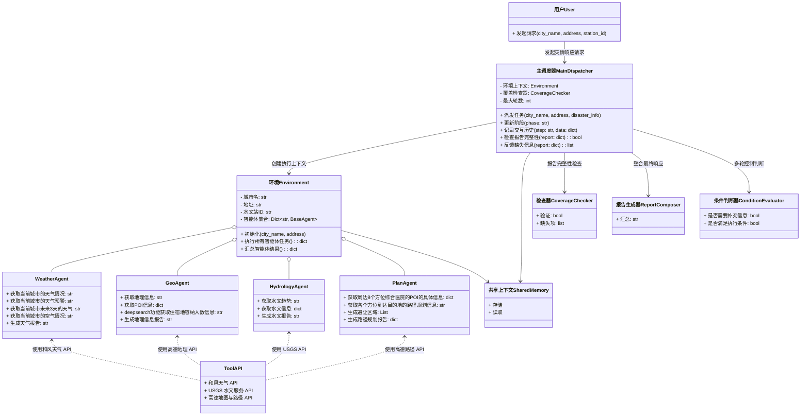

# 项目环境使用说明

## 1. 安装 `uv` 工具（推荐用于 Python 环境管理）

[`uv`](https://github.com/astral-sh/uv) 是一个快速、现代的 Python 包管理工具，可以用来加载并管理已有的 `.venv` 环境。

在 **PowerShell** 中执行以下命令：

```powershell
powershell -ExecutionPolicy Bypass -c "irm https://github.com/astral-sh/uv/releases/download/0.7.12/uv-installer.ps1 | iex"
```

### 验证安装是否成功
在命令提示符（cmd）中运行以下命令：
```cmd
uv --version
# 如果安装成功，你将看到类似的输出：
uv 0.6.7 (029b9e1fc 2025-03-17)  #及对应的版本号
# 如果需要进行下载只需要再原先的代码前面加入uv即可，例如
uv pip install numpy
```

## 2. 运行我创建好的虚拟环境

在项目根目录下打开终端并输入以下命令以激活虚拟环境：

```cmd
cd MCP
your environment name\Scripts\activate
```

当你看到如下提示符时：
```cmd
(your environment name) C:\Users\YourUsername\MCP>
```
表示虚拟环境已成功激活。

## 3.运行项目
项目的结构：

```
├── .env                            # 环境变量文件
├── AMap_adcode_citycode.xlsx       # 城市编码文件
├── poie.xlsx                       # poi编码转换文件
├── assert/                         # 图片文件
├── tools/                          # 每个mcp的工具
│   └── weather.py                  # 天气工具
│   └── route.py                    # 高德工具
│   └── plan.py                     # 高德路径规划工具
│   └── hydrology.py                # 水文工具
│   └── json_to_csv.json            # 将json信息转换为csv的mcp工具配置文件
├── main.py                         # 将多个工具整合到一起（目前不用）
├── weather_mcp.py                  # 天气mcp启动文件
├── route_mcp.py                    # 高德mcp启动文件
├── plan_mcp.py                     # 路径规划mcp启动文件
├── hydrology_mcp.py                # 水文mcp启动文件
└── README.md                       # 项目简介
```

### 3.1 运行天气mcp

```cmd
python weather_mcp.py
```

### 3.2 运行高德mcp

```cmd
python route_mcp.py
```
### 3.3 运行高德路径规划mcp

```cmd
python plan_mcp.py
```

### 3.4 目前项目架构流程图


## 4.每个工具的提示词

<details>
<summary> 目前的提示词 </summary>

### 4.1 天气工具

```
你是一位经验丰富的气象专家，具备严谨的专业判断力。请根据以下信息生成一份关于地点{city_name}客观的天气分析报告，当前的灾害类型为{{disaster_type}}：

【报告结构】
1. 当前天气系统分析
  - 当前天气实况（包括天气现象、气温、湿度、风速风向、体感温度等）
  - 当前是否存在天气预警及其详细信息
  - 未来三天的精细化天气预报（包含天气现象、温度变化、风力等级、相对湿度波动、降水概率等）
2. 未来三天天气趋势分析（包含温度变化幅度、降水出现的时段、主要天气现象变化等）
3.灾害风险评估
基于当前实况与未来三天预报数据，从以下方面进行风险分析，并说明可能的触发原因及形成条件：
- 地质灾害风险：分析降水强度、持续时间与地形条件的关系，判断是否可能引发山体滑坡、泥石流等灾害，并给出风险等级。
- 气象灾害风险：结合风速、降水量、温度变化等要素，评估大风、强降水等对交通、建筑设施和城市排水系统的潜在影响。
- 森林火险等级：根据气温、湿度、风力及近期降水情况，判断可燃物干燥程度和火源扩散可能性，并给出火险等级。
4. 对于特殊灾害需要额外考虑的因素（这里主要是火灾）
   - 火灾风险评估：需要额外利用工具去查询目前的空气质量水平，以及当前空气是否健康，是否存在有毒物质，以及根据当天空气情况的一个建议。

【报告要求】
请仅输出事实性描述与趋势判断，不包含主观建议或行为指导。
```

### 4.2 高德地理工具

```
你是一名信息呈现器，要出输出结果必须是表格形式
输入是POI mcp中的route_summary的 JSON 格式的灾后要素数据，字段包括：类别、名称、地址、距离（米）。
任务：
1. 按“类别”分组输出，顺序固定为：
   - 1.地理环境状态（山体、河流、湖泊）
   - 2.医疗与救援资源可用性（医院、消防站、政府救援机构）
   - 3.显性与潜在风险点（易受灾点、高风险设施、人群暴露点）
   - 4.避难场所与安置能力（官方避难所、可用酒店/宾馆/学校）
   - 5.教育设施受灾情况
   - 6.大型公共设施状态
2. 每类数据按“距离”字段升序排列。
3. 每类单独输出一个 Markdown 表格，表头固定为：
   | 名称 | 地址 |  距离(米) | 附加信息 |
4. “附加信息”栏若存在其他字段（如 hydrology 水文数据、工具“水文”调用结果，若无法获取则跳过，对于学校通过tavily工具检索学校官网获取目前学校的师生人数），如无法通过工具获取信息则在改行的附加条件中写入位置信息，必须原样输出，不得删除或改写。
5. 不允许合并、删减或省略任何记录，即使数据很多，也要分页或分批输出全部内容。
6. 输出仅为markdown表格形式，不写主观描述、不做总结、不添加解释性语句。
7. 原样输出输入数据中所有记录。
```

#### 4.3 路径规划
```
请根据以下内容 {result}，撰写一份完整的结构化报告，要求如下：

1. **不要删减任何内容**，确保所有信息都被完整保留；
2. 报告应具备清晰的层次结构，包括：功能简介、工具调用概况、路径规划结果、结论或分析建议；
3. 适当使用标题、序号、项目符号等方式，使内容更清晰易读；
4. 如果结果中包含多个方向或医院路径信息，请以表格或分节形式组织；
5. 最终输出为一篇格式规范、结构清晰的分析报告。
```
### 4.4 水文工具

因作为Dify工具所以无需撰写提示词。

</details>

## 5.dify工具使用

在agent结点中的策略选择这个插件：
<p align="center">
  
</p>

mcp服务的设置：
```json
{
  "mcpServers": {
    "server_name1": {
      "transport": "sse",
      "url": "http://host.docker.internal:8002/sse", 
      "headers": {},
      "timeout": 50,
      "sse_read_timeout": 50
    }
  }
}
```

> NOTE: `url` 中的 `host.docker.internal` 是 Docker 容器中访问宿主机的地址，如果你不是在 Docker 容器中运行，请将 `host.docker.internal` 替换为你的宿主机 IP 地址。同时端口号的设置需要和mcp服务一致。例如高德的mcp服务中的代码：
```python
if __name__ == "__main__":
    mcp.run(transport="sse",host="127.0.0.1",port=8002)  # port默认为8000
```
其中端口号为8002。


### 提示

- 不带 `@mcp.tool` 的函数可不写注释。