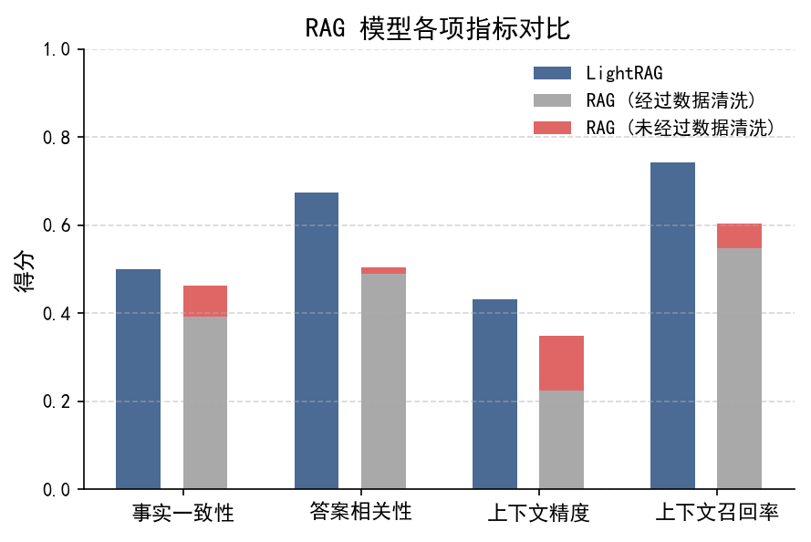

# 关于 RAG 及其评估方法

## 1. LightRAG 使用说明

详细的安装与使用方法请参考官方仓库：[LightRAG GitHub](https://github.com/HKUDS/LightRAG)。

在本项目中，我们主要对其默认的提示词（Prompt）进行了定制化修改，以更好地适应具体任务场景。
同时，也支持在 Dify 中由用户自定义提示词进行内容查询。

为了实现 LightRAG-Server 与 Dify 的对接，我们采用了模拟 Ollama 协议的方式，
将 LightRAG-Server 的输出封装为 Ollama 接口格式，从而供 Dify 正常调用。
实现细节可参考 `lightrag_to_ollama.py` 文件。

## 2. RAG 评估指标与方法

我们主要采用 [**RAGAS**](https://github.com/explodinggradients/ragas) 库，对以下三种配置进行多维度评估：

- 标准 RAG（经过数据清洗）  
- 标准 RAG（未清洗原始数据）  
- LightRAG（经过数据清洗）

评估指标包括：

1. **Faithfulness**（事实忠实度）  
2. **Answer Relevancy**（回答相关性）  
3. **Context Precision**（上下文精度）  
4. **Context Recall**（上下文召回率）  

评估结果如下图所示：

  

