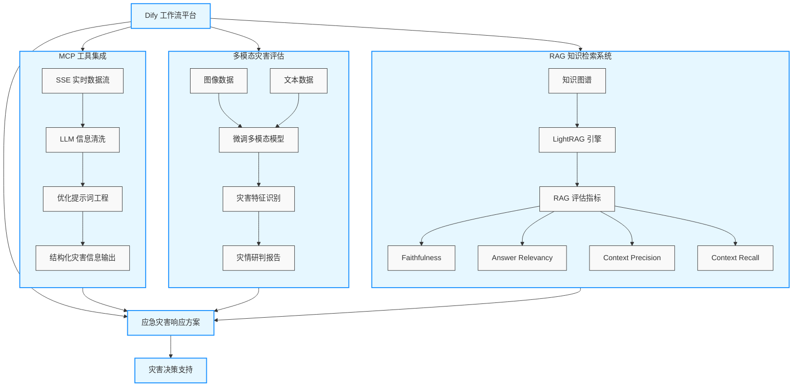

# 应急灾害智能体

本项目主要基于 [Dify](https://github.com/langgenius/dify) 平台搭建应急灾害响应工作流，并集成 **MCP 工具**、**多模态灾害评估模型** 与 **RAG 知识检索系统**，以实现高效的灾害信息获取与决策支持。



## 1. 平台与工具集成

### 1.1 Dify 工作流
- 使用 Dify 搭建多节点条件判断与工具调用的工作流`应急灾害方案生成智能体.yml`
- 支持条件分支、信息过滤、多轮生成等复杂逻辑。

### 1.2 MCP 工具集成

为了增强工作流的外部能力，本项目通过 MCP 框架集成了多种工具，并采用 SSE实现实时数据流接入。在获取到原始信息后，首先会通过自定义的 LLM 对内容进行去重、纠错和冗余清理，避免数据噪声影响决策。针对不同工具的职能，系统会自动生成优化后的提示词（Prompt），确保 LLM 在调用时能返回与任务高度相关的结果，并将所有工具输出格式化为统一的结构化数据，以方便后续的信息聚合与分析。相关工具注册与调用示例可参考 [MCP](./MCP)目录。

## 2. 多模态灾害评估

在灾害评估模块中，我们基于多模态模型进行了针对性微调，使其能够学习更多与灾害场景相关的图像和文本特征，从而提升对多源信息的综合分析能力。在实际应用中，该模型能够同时处理灾区的卫星影像、现场拍摄图片、传感器数据及文字报告等多模态输入，自动提取关键信息并进行特征融合，辅助生成更精准、更全面的灾情研判结论。此类能力对于快速识别受灾范围、评估受损程度和制定救援优先级尤为重要。微调方法、数据准备流程及参数说明详见 [Fine-tuning](./Fine-tuning) 目录中的文档。

## 3. 知识检索与 RAG 系统

### 3.1 RAG 方案
- 采用知识图谱驱动的 **RAG（Retrieval-Augmented Generation）** 方案进行信息检索。
- 聚焦 [LightRAG](https://github.com/HKUDS/LightRAG) 工具的应用实践。

### 3.2 RAG 评估
- 使用 `RAGS` 库对以下不同 RAG 方案进行评估：
  1. 标准 RAG（数据清洗后）
  2. 标准 RAG（未经数据清洗）
  3. LightRAG（数据清洗后）
- 评估维度：
  - Faithfulness（真实性）
  - Answer Relevancy（答案相关性）
  - Context Precision（上下文精确率）
  - Context Recall（上下文召回率）

- 评估代码与结果见：[RAG_eval](./RAG_eval)

## 4. 项目结构

```
├── MCP/                            # MCP 工具相关实现
├── RAG_eval/                       # RAG 评估相关代码与结果
├── Fine-tuning/                    # 模型微调方法与文档
├── requirements.txt                # 项目依赖
├── 应急灾害方案生成智能体.yml        # Dify 可导入 DSL 工作流文件
└── README.md                       # 项目说明文档
```

## 致谢

本项目得益于以下优秀开源项目的支持，特此致谢：

- [LightRAG](https://github.com/HKUDS/LightRAG)：轻量级 RAG 检索生成框架  
- [Dify](https://github.com/langgenius/dify)：可视化工作流与智能体平台  
- [LLaMA-Factory](https://github.com/hiyouga/LLaMA-Factory)：高效的 LLaMA 系列模型微调框架  
